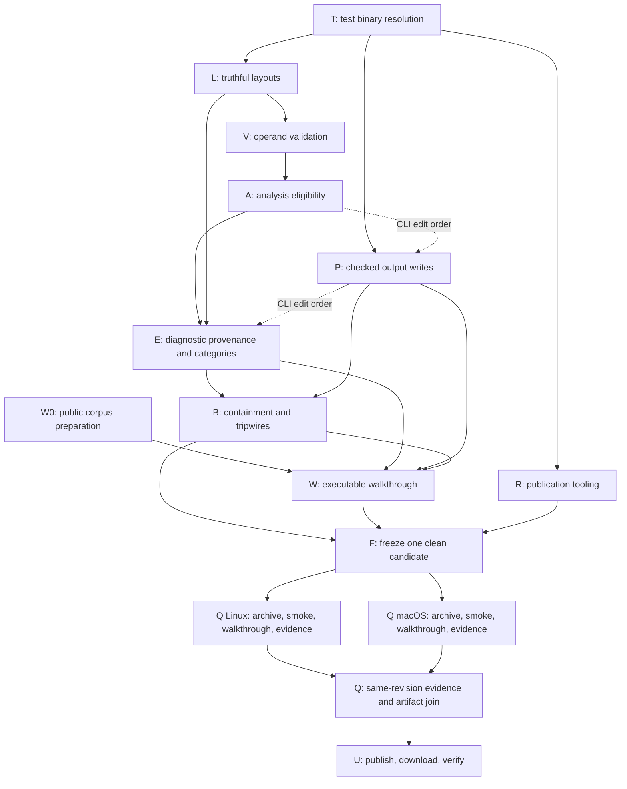

# `luad` roadmap

Status: plan of record.

Fresh as of: 2026-09-17.

The next release is **0.2.0: trustworthy reads and usable shell workflows**. Its
promise will be that accepted layouts govern the facts, incomplete validation cannot
authorize analysis, and ordinary investigation does not crash or conceal failures.
All dialects will remain experimental; the supported target set will remain empty.

The stages below are release obligations ranked by user impact, not implementation
authorization. The dependency schedule below determines delivery order.
Each stage must first place its contract in [the active sprint](docs/NEXT-SPRINT.md),
following [the contract lifecycle](docs/DEVELOPMENT-WORKFLOW.md#12-preservation-documentation-and-escalation).
Keep the checkpoint neutral until that work starts. The separate
[1.0 qualification program](docs/ROADMAP-1.0.md) will not become a prerequisite for
shipping 0.2.

## Next

Start with stage 5 as the bounded verification prerequisite, then stage 1. Front-load
the resolver migration because it changes tests that every later branch will use.
The [execution schedule](#02-execution-and-dependencies) defines the remaining order
and the conditions for overlapping work; the numbers below identify outcomes, not
independent authorization to start eight coding tasks.

### 1. Make every accepted layout truthful

Make Lua 5.2, 5.3, and 5.5 honor or explicitly refuse every representation declaration:
format, byte order, integer/count widths, string-length widths where serialized,
instruction width, numeric width/mode, and serialized test values. Probe 5.1 and 5.4 as
regression controls. Check both detected and explicitly selected dialects, in strict
and permissive mode. Permissive parsing must never guess an unsupported layout.

Derive the reported interpretation from the validated layout actually used. In 5.3,
keep C integer/count width distinct from `lua_Integer`; in 5.5, do not invent a
serialized `size_t` declaration. Preserve encoded numeric bits independently of display.
Use the pinned upstream loaders as authority:
[5.2.4](https://www.lua.org/source/5.2/lundump.c.html),
[5.3.6](https://www.lua.org/source/5.3/lundump.c.html), and
[5.5.1](https://www.lua.org/source/5.5/lundump.c.html).

**Acceptance:** through library and CLI boundaries, valid originals retain exact
instructions/constants; supported declarations govern the body and interpretation;
unsupported declarations fail at the header with the field, observed value, and byte
offset. Exercise long strings and actual numeric constants so a changed but unused
header field cannot masquerade as proof. Corrupt each applicable test value and require
rejection. Include text, JSON, JSONL, and export agreement where those formats exist.

**Stop:** explicit refusal is sufficient for an unimplemented representation. Do not
add EdgeTX, new numeric formats, automatic layout inference, or target promotion.

### 2. Make validation and analysis eligibility honest

Close the direct operand-bound holes in Lua 5.2, 5.3, and 5.5: register operands and
fixed register spans, constant/RK references, upvalue references, and child-prototype
references. Define the complete opcode/operand matrix from each version's authority;
immediate/count operands must not be mistaken for registers. Check nested prototypes
and preserve non-executable companion roles.

Separately enforce the meaning of analysis eligibility at the shared boundary. A
parser-only verdict must not authorize CFG, xrefs, query, diff, or derived export facts.
Until a dialect's complete analysis preconditions are established, refuse those
analyses explicitly while retaining honest parse/raw inspection. Preserve the accepted
Lua 5.1 and 5.4 analysis paths through explicit dialect preconditions: Lua 5.1 currently
returns `valid-for-parser` even after its more extensive checks, so verdict-enum equality
alone cannot make this decision. Reject unknown dialects instead of falling back to the
Lua 5.4 lifter, including direct library callers.

**Acceptance:** positive compiler fixtures and one-past-bound mutations exercise every
owned operand family; malformed inputs cannot produce a successful strict validation
with zero findings. Test analysis refusal on otherwise parseable inputs with inadequate
preconditions, both sides of `diff`, and selected export families. Raw inspection must
remain available where parsing is valid. Text and machine output must distinguish
parser checks from analysis eligibility; document any intentionally narrowed surface.

**Stop:** no new analysis algorithm or blanket `valid-for-analysis` promotion. Full
validator parity for additional dialects requires later evidence, not a renamed verdict.

### 3. Make closed output pipes ordinary termination

Close [issue #78](https://github.com/dweekly/luad/issues/78) across incremental text,
JSON/JSONL, export, schema, diagnostics, and completion output. Propagate writer errors
and handle stdout `BrokenPipe` as quiet termination with exit 0. Retain exit 3 for
other output I/O errors. Do not catch arbitrary panics or introduce unsafe signal code.

**Acceptance:** a child-process test closes the reader deterministically, including
before the first write and partway through a stream; stderr contains no panic and the
producer returns the specified status on Linux and macOS. A non-pipe writer failure
must remain an error. Full-output controls remain byte-identical. Document that an
abandoned JSONL stream lacks its completion record even when the producer exits 0.

**Stop:** no renderer redesign beyond the error propagation needed by this outcome.

### 4. Make failures point to the right byte and exit category

Attach the actual offending field location to body-parser and limit diagnostics;
preserve it through prototype context and CLI/export wrapping. Eliminate the invented
offset-zero fallback for missing locations. Do not attribute a body failure to a
particular header contradiction without evidence.

Use typed failure classification at the process boundary: malformed recognized input
returns 1, I/O returns 3, unsupported representation returns 4, and configured resource
exhaustion returns 5. Preserve the documented mixed-export aggregation policy while
retaining each file's actual failure classification.

**Acceptance:** pin exact offsets for malformed tags, nested truncations, bad counts,
and limit failures; include nonzero reader base offsets. Exercise single-file and
batch output in the public error matrix. A syntactically valid count of 1,000,001
instructions against the default 1,000,000 ceiling must report the count field and
exit 5, rather than offset 0 and exit 1.

**Stop:** no partial-facts recovery or speculative corruption diagnosis.

### 5. Remove nested CLI builds from integration tests

Make every CLI-driving integration test use one resolver that never invokes a build.
Build once at the outer test entry point; pass the exact binary path, honor
`CARGO_TARGET_DIR`, and fail actionably when the binary is missing. Apply this to the
existing shared resolver as well as the remaining per-test copies.

**Acceptance:** run the CLI test surface with an explicitly built binary in a
non-default target directory. Exercise a missing-binary case with a failing build-command
sentinel and prove no nested `cargo build` occurs. Keep failures visible; retries are
not acceptance evidence. Qualification tools that intentionally build fixtures or
packages remain separate from CLI resolution.

**Stop:** no general test-harness replacement or new evidence layer.

### 6. Close concrete hostile-input containment gaps

Bound regular-file reads while reading, not solely with a preceding metadata check.
Audit diagnostic accumulation, debug-vector counts, analysis traversal, and rendering
for allocations or work that bypass the existing limits. Cover exposed experimental
paths as well as the preferred firmware profiles; an unavailable analysis must refuse
before expensive work. Bound validator diagnostic accumulation and replace the Lua 5.1
validator's quadratic duplicate scan with bounded deduplication that preserves order.

Establish a small subprocess tripwire matrix: tiny malformed input, large instruction
vectors, deep prototypes, long strings, repeated invalid operands, and a mixed batch.
Freeze numeric wall-time, peak-memory, and output ceilings on the named Linux/macOS
runner classes in this stage's qualification contract before implementation. Include
an intentionally over-budget control that proves the monitor detects a breach.

**Acceptance:** retain bounded fuzz-smoke results and minimized public regressions for
every discovered panic, timeout, excessive allocation, or false verdict. Test limit
boundaries and complete/truncated export accounting; no unexplained resource overrun
may be accepted as an experimental limitation.

**Stop:** no general benchmark service, all-version corpus generator, or unbounded
fuzz campaign. A new material finding gets a bounded correction contract.

### 7. Ship one reproducible firmware investigation

Put one concise walkthrough in the README, with details in the existing recipes:
obtain a pinned public input tree, inventory it, find a literal/global lookup, inspect
its instruction and original bytes, and hand a compatible chunk to a pinned decompiler.
Include compiled `.lua` and `.luac` files, source, malformed input, and an unsupported
layout, with an explicit terminal outcome for every discovered input.

Use redistributable inputs with hashes, licenses, and exact build/download commands.
Prefer a public OpenWrt-derived tree; if firmware redistribution is unsuitable, use
public source compiled by the pinned authority and label it a firmware-shaped example.
Private customer samples cannot be the prerequisite or the public demonstration.

**Acceptance:** replay the exact commands from an installed candidate in a fresh
directory and assert expected facts, input identities, failure counts, and stream
completion. Truncating a stream or dropping a file result must fail the consumer check.
A reader must not need to write a bytecode decoder. Mark experimental facts explicitly
and revalidate external-tool compatibility when selecting the handoff.

**Stop:** one complete walkthrough, no extraction engine, database product, adapter
framework, or mandatory outside-user study for 0.2.

### 8. Publish verifiable 0.2 artifacts automatically

Complete the production publication mode using the existing archive, SBOM, bundle,
and publication machinery. Bind both platform archives, checksums, source inventory,
and build-provenance attestations to the same accepted revision; attach the SBOM
without a manual maintainer step. Generate provenance in the build workflow, using
[GitHub artifact attestations](https://docs.github.com/en/actions/how-tos/secure-your-work/use-artifact-attestations/use-artifact-attestations).
Keep its claim about build origin separate from bytecode correctness and the source
SBOM separate from a claim about exactly linked binary components.

**Acceptance:** offline publication regressions cover missing assets, stale revision,
failed prerequisites, and altered bytes. Then publish the accepted bytes without
rebuilding, freshly download every asset, verify checksums and installation on both
platforms, and verify each archive with
`gh attestation verify <archive> --repo dweekly/luad`. Also assert the expected source
revision and build-workflow identity in the verified statement. A corrupted archive
must fail verification. Exercise the documented partial-publication/withdrawal path
without moving an existing version tag.

**Stop:** no new package manager, platform, custom signing-key service, target manifest,
or 1.0 evidence index. Reconcile touched workflow documentation with the actual job
layout; do not redesign CI merely to publish 0.2.

## 0.2 execution and dependencies

### Execution policy

Use a steward to own contracts, shared interfaces, integration, schemas, and final
acceptance. Give each implementation assignment production code and ordinary tests
together. Read-only preparation can run alongside the active implementation.

The default delivery order under the current single-contract workflow will be:

```text
5 test resolution
  -> 1 layouts
  -> 2 operand validation and analysis eligibility
  -> 3 output pipes
  -> 4 failure provenance and exit categories
  -> 6 containment
  -> 7 executable walkthrough
  -> 8 publication tooling
  -> frozen candidate / both-platform verification / publication
```

This order reserves the shared CLI files for one owner at a time. Start public-input
selection, operand-authority review, resource-case design, and release-workflow review
during earlier stages; those activities need not wait for code to be accepted.

**Parallel implementation will require a process decision first.** The current
[workflow](docs/DEVELOPMENT-WORKFLOW.md#9-worktrees-and-parallelism) requires disjoint
paths, separate worktrees/PRs, an immutable base, and deterministic integration order;
its single-active-contract and one-product-PR rules do not authorize several unrelated
stages at once. Before using the optional concurrent schedule below, make a bounded
planning amendment to that workflow and its documentation index. It must explicitly
allow a named release wave of independently accepted slices, specify how their
contracts are represented in `NEXT-SPRINT.md`, and restore the neutral checkpoint when
the wave closes. Keep target-promotion rules unchanged. Without that amendment, use
the serial delivery order and parallelize only preparation and read-only verification.
This release plan neither applies that amendment nor opens an implementation contract.

### Work packages and actual prerequisites

Use these identifiers in assignments and handoffs. A prerequisite means **accepted
output at a pinned revision**, not a branch that appears nearly finished. Research and
case design may precede implementation prerequisites. Subpackages describe dependency
boundaries; they need not each become a separate PR in serial execution.

| Package | Deliverable | Must be ready before implementation/acceptance | What it unblocks |
|---|---|---|---|
| **T — stage 5** | One no-build CLI resolver, migrated callers, outer build entry points, candidate override preserved | Exact binary-selection precedence and launcher inventory fixed in its contract | Reliable CLI acceptance and a stable test base for every later package |
| **L0 — stage 1 preparation** | Allowed-layout matrix, interpretation spelling, error-code allocation, fixture authority, public assertions | T for executable probes; any necessary shared-model decision settled by the steward | Independent dialect work without competing core/schema edits |
| **L52 / L53 / L55 — stage 1** | Each dialect's complete honor-or-refuse behavior and ordinary tests | L0 and the same immutable base | L, and that dialect's validator implementation |
| **L — stage 1 integration** | Public layout matrix across commands/formats and 5.1/5.4 regression controls | All three dialect slices; any shared prerequisite merged before their fork | Final validation inputs, error classification cases, walkthrough expectations |
| **V52 / V53 / V55 — stage 2** | Per-dialect exhaustive direct operand and fixed-span checks | Corresponding L slice; authoritative operand matrix and companion exclusions fixed | V and the analysis-eligibility boundary |
| **V — stage 2 integration** | Cross-dialect validation positives and corruption controls | All V slices, L, and unchanged 5.1/5.4 controls | Honest public validation and stable validation outcomes for A/E |
| **A — stage 2 integration** | Explicit analysis eligibility, unknown-dialect refusal, CLI/export integration | V; decision on supported analysis operations and raw inspection fallback | Safe analysis dispatch, final walkthrough fact selection, containment surface |
| **P — stage 3** | Checked output writes and quiet broken-pipe handling | T; writer/exit policy fixed. Bytecode semantics do not block it | Reliable command transport and output-bound testing |
| **E — stage 4** | Exact field locations and typed failures preserved through CLI/export | L, V, A; integrate after P because both change command return/error paths | Stable failure contract for containment and mixed-tree examples |
| **B — stage 6** | Bounded reads/diagnostics/traversal plus measured tripwires | L, V, A, P, E; numeric budgets and monitor negative controls frozen first | Candidate resource acceptance |
| **W0 — stage 7 preparation** | Public input choice, licenses/hashes, fact expectations, external-tool version choice | No code dependency for research; fixture writes require their stated authority scope | W without waiting for private firmware or a new profile |
| **W — stage 7** | Executable recipe and completion-checking consumer; development-package rehearsal | W0, L, A, P, E; final acceptance after B | Candidate walkthrough and accurate user documentation |
| **R — stage 8 tooling** | Production publication mode, automatic SBOM attachment, build attestations, offline failure tests | T; exact artifact/job identity contract. Parser/validator completion is not a code dependency | Frozen-candidate packaging/publication; no permission to publish a product yet |
| **F — candidate freeze** | Clean 0.2 revision, version/schema notes, limitations, accepted prerequisite identities | T, L, V, A, P, E, B, W, R all accepted | Final same-revision Linux/macOS work |
| **Q — candidate verification** | Both archives, required CI/gates, fuzz/tripwire results, packaged walkthroughs, authenticated bundle | F and pinned tools on each platform | Publication eligibility |
| **U — publication and fresh-download verification** | Immutable tag/assets, verified origin/checksums/install/walkthrough, release pointer | Complete Q for both platforms; accepted publication contract | Release complete only after public downloads pass |

T is an engineering prerequisite, not evidence that bytecode behavior depends on test
resolution. Likewise, P can be implemented before A in isolation; its position after A
in the default schedule prevents overlapping edits. Layout acceptance can precede E:
L must prove the field, code, location, and rejection, while E owns the final public
exit-category mapping. Do not make L wait for E and E wait for L.

### Dependency graph

Solid arrows below denote acceptance prerequisites. Dashed arrows denote the chosen
shared-file integration order. W0 may start immediately; R can overlap product fixes
only under the explicit parallel-process amendment above.



### Safe parallel work and collision boundaries

| Work pair | Can overlap? | Boundary that makes the answer true |
|---|---|---|
| Active coding + authority review, public-input research, release design | **Yes, under the current workflow** | Read-only work produces a review packet; it does not edit shared fixtures, plans, schemas, or manifests |
| Linux + macOS verification of one accepted candidate | **Yes, under the current workflow** | Same source revision, separate build hosts/workspaces, platform-specific outputs, one final joining verifier |
| L52 + L53 + L55 | **Technically yes; amendment required for multiple implementation PRs** | Each owns only its dialect crate and dedicated test file; L0 must settle shared representation and diagnostic decisions first |
| V52 + V53 + V55 | **Technically yes; same condition** | Dedicated validator/test paths and each accepted L prerequisite; one integrator owns shared analysis dispatch and cross-dialect tests |
| Layout code + pipe code | **Technically yes; same condition** | Layout workers cannot edit `main.rs`, renderers, shared machine tests, or schemas; P cannot change parse/analysis behavior |
| Product fixes + R publication tooling | **Best sustained overlap after T, if authorized** | R owns release workflow/scripts/tests; product workers own no release jobs, manifests, or metadata version bump |
| Layout + validator edits for the same dialect | **Do not schedule together** | V consumes L's accepted layout and fixture interpretation; early authority review is useful, speculative production edits are not |
| A + P + E + bounded-input CLI edits in B | **Serialize** | All touch `crates/luad-cli/src/main.rs`; return types, export failure paths, and format behavior interact |
| Validator expansion + diagnostic-budget changes | **Serialize** | B must bound V's complete diagnostic behavior; both touch validators and their expected diagnostics |
| New schemas, diagnostic catalog, fixture manifests, README/roadmap | **One steward/integrator at a time** | These are cross-cutting contracts, not independently mergeable ownership slices |
| Canonical gate runs + edits to the candidate | **No** | Clean revision and binary identity must stay fixed while evidence is generated |
| Tripwire benchmarking + heavy build/fuzz work on the same host | **No** | Contention can invalidate runtime/memory measurements; use isolated runners or serialize them |

Do not run several Cargo test suites against one mutable target directory and call
that parallel qualification. Each worktree will use its own target and evidence
directories. Never use another branch's debug binary. Host platforms may run in
parallel, but a platform result cannot substitute for the other platform's result.

### Optional concurrent schedule

If the parallel-process amendment is selected, use a small number of active owners:
one steward, up to three dialect workers during a dialect wave, or one product worker
plus one release worker plus one read-only researcher during CLI work. These are
maximum useful assignments, not a requirement to keep workers busy.

1. **Preparation:** accept T serially. In parallel, review the operand authorities,
   design L0's cases, select W0 inputs, and inspect the release job/asset graph. Keep
   code, fixture, and schema writes out of those preparation assignments.
2. **Layout wave:** settle L0 and merge any necessary shared prerequisite first. Fork
   L52/L53/L55 from that one revision, each with production and tests. Integrate in
   fixed order 5.2, 5.3, 5.5; the steward owns public-format assertions and metadata.
   R remains preparation-only while all three worker slots are used.
3. **Validation wave:** fork V52/V53/V55 from accepted L. Keep shared test helpers and
   analysis dispatch frozen. Integrate in the same dialect order, then complete A as
   a serial shared-boundary change. Do not split individual opcode families into
   separate agent rounds when one table-driven implementation owns them.
4. **CLI and release overlap:** run P, then E, then B serially on the product track.
   Run R in a separate worktree alongside that track, with its offline publication
   tests and no live product release. Continue W0 and resource-case preparation as
   read-only work. Merge R only when its shared test/CI dependencies are stable.
5. **Workflow closure:** complete W against the accepted product behavior. Integrate
   product and release tracks, fix routine composition issues, then freeze F. A
   previous recipe rehearsal is preparation; final walkthrough evidence uses F's
   actual package bytes.
6. **Candidate fan-out:** run Q on Linux and macOS in parallel with isolated outputs.
   Collect required gates once for their stated platform scope; do not duplicate an
   entire semantic suite just to create another release attestation. Perform the
   cross-platform artifact/evidence join only after both results are complete.
7. **Publication:** U is a single serialized operation. Upload the accepted bytes,
   verify fresh downloads and provenance, then advance the release pointer. Never
   rebuild at upload time or move an existing version tag.

The dependency chain most likely to govern elapsed time is L → V → A → P → E → B → W
→ F → Q → U, with T in front. R is an independent feeder into F and will delay the
release if it finishes later. This is a scheduling assessment, not a measured duration
estimate. Measure the first accepted batches before assigning dates; do not promise a
speedup proportional to agent count.

### Ownership and integration protocol

Freeze a package's contract, immutable base, allowed production/test paths, tool and
fixture identities, commands, and expected assertions before assigning it. A shared
prerequisite belongs to the steward and merges before dependent branches start.
If a worker needs an unowned path, stop that edit and have the steward decide whether
to supply a shared prerequisite or serialize the remaining work.

All new tests will use T's resolver. Preserve authoritative `LUAD_CANDIDATE_BIN`
selection, including hard errors for empty, missing, directory, or non-executable
values; it must never silently fall back to the developer binary. Support
`CARGO_BIN_EXE_luad` and a non-default `CARGO_TARGET_DIR` through the same declared
precedence. Fixture/compiler builds and release-package builds are separate operations
and must not be accidentally disabled by the no-build resolver change.

Parallel dialect workers will use dedicated files such as
`test_layout_truth_lua52.rs` and `test_validator_bounds_lua52.rs`, with corresponding
53/55 files. They will not co-edit `test_validation_null_hypothesis.rs` or
`test_machine_interface.rs`. The integrator will add cross-dialect coverage and update
the diagnostic catalog/schema goldens once. The serial implementation may instead use
one table-driven test target; choose the file map before starting, not mid-assignment.

E must retain the original structured diagnostic through export, not only fix stderr
or map an integer status. B must preserve that location/category when a budget stops
work. P must propagate serialization and writer failures without substituting an empty
successful record. W's consumer must check terminal records, not equate process exit 0
with complete JSONL. These cross-package assertions belong to final composition tests.

Accept branch-local focused results as candidate evidence only. Integrate in the
specified order, rebuild the merged binary, and rerun the focused test and applicable
existing gate affected by composition. Run one aggregate check for each accepted batch
in its chosen local/CI lane, and one for the final candidate; do not duplicate local
and hosted aggregate runs without a diagnosed need. Reuse prerequisite evidence only
when the release/gate contract permits its identity and dependency closure.

Any change to shared public records or enum vocabularies triggers the existing
schema-major policy before consumers and fixtures are finalized. The steward will
settle this at L0/A/E as applicable; R will consume finalized schema/version metadata
at F. A late compatibility decision must not be hidden inside the version bump.

## 0.2 executable acceptance map

New test targets marked **proposed** must acquire concrete assertions in the active
contract before implementation. Their names are not evidence of a pass. Paths below
are repository-relative; ordinary test files live in `crates/luad-oracle/tests/`.
The commands assume the owning checkout has built the CLI and exported its exact path.

```console
cargo build --locked -p luad-cli --bin luad
export CARGO_BIN_EXE_luad="$PWD/target/debug/luad"
```

T must also validate the same flow with a custom target directory, adjusting the
exported path to that directory. Candidate acceptance will set `LUAD_CANDIDATE_BIN`
to the verified extracted executable instead. Qualification-tool builds stay explicit.

| Package | Principal production paths | Focused executable acceptance |
|---|---|---|
| T | `crates/luad-oracle/src/{lib,candidate}.rs`; CLI-driving tests; `scripts/check.sh` and affected test/gate launchers | **Proposed:** `cargo test -p luad-oracle --test test_cli_binary_resolution`; retain `cargo test -p luad-oracle --test test_candidate_lua51_lnum32 --test test_cli_e2e` |
| L | `crates/luad-dialect-lua{52,53,55}/src/{header,chunk}.rs`; shared layout/scalar types only if explicitly scoped | **Proposed serial target:** `cargo test -p luad-oracle --test test_layout_truth_stock_lua`; **parallel alternative:** `cargo test -p luad-oracle --test test_layout_truth_lua52 --test test_layout_truth_lua53 --test test_layout_truth_lua55` |
| L controls | Existing parsers, scalar rendering, public records | `cargo test -p luad-oracle --test test_lua52_parser --test test_lua53_parser --test test_lua55_parser --test test_scalar_rendering --test test_differential_oracle --test test_oracle_negative_controls` |
| V | Dialect `validator.rs` and dedicated ordinary tests | **Proposed:** `cargo test -p luad-oracle --test test_validator_bounds_lua52 --test test_validator_bounds_lua53 --test test_validator_bounds_lua55`; `cargo test -p luad-oracle --test test_validation_null_hypothesis` |
| A | `crates/luad-analysis/src/lib.rs`; CLI/export analysis dispatch and affected callers | **Proposed:** `cargo test -p luad-oracle --test test_analysis_eligibility`; preserve existing 5.1/5.4 analysis-precondition gates |
| P | `crates/luad-cli/src/main.rs`, `render/`, `exit_codes.rs` | Extend `cargo test -p luad-oracle --test test_cli_e2e` with deterministic pipe/writer controls; use a dedicated pipe test file if T migration would otherwise overlap |
| E | `crates/luad-core/src/{reader,diagnostic}.rs`; affected dialect errors; CLI parse/export errors | Extend `cargo test -p luad-oracle --test test_machine_interface --test test_batch_export` with exact offsets, retained structured errors, and exit/status assertions |
| B | Explicitly audited reader/limits, CLI, parser, validator, analysis paths; `fuzz/` | `cargo test -p luad-oracle --test test_hostile_count_allocations --test test_adversarial_inputs --test test_batch_export_bounds`; `bash scripts/fuzz_smoke.sh artifacts/0.2-fuzz-smoke`; freeze the new tripwire command in the qualification contract |
| W | `README.md`, `docs/examples/RECIPES.md`, public fixture provenance, example runner | **Proposed:** `cargo test -p luad-oracle --test test_firmware_walkthrough`, using T's resolver for both development and packaged binaries |
| R | `.github/workflows/{ci,release-publication}.yml`; `scripts/release-publication.sh`; existing release helpers only as needed | `cargo test -p luad-oracle --test test_release_package --test test_release_sbom --test test_release_bundle --test test_release_publication`; no production publication during tooling acceptance |
| F/Q/U | Version/schema/release documentation, existing build/bundle/publication entry points | `bash scripts/check.sh`; exact applicable gates; both-platform package walkthroughs; fresh download/checksum/attestation verification under the final release contract |

Before each package starts, enumerate exact test paths and any shared-model/schema
changes in its contract. Reuse `gate-machine-contract`, `gate-cli-selection-contract`,
`gate-batch-export`, and `gate-batch-export-bounds` when their boundaries change. A must
preserve `gate-semantic-safety-lua51` and `gate-validator-soundness-lua54`; L must retain
the relevant existing layout and public-disassembly controls for 5.1/5.4. Invoke an
applicable wrapper as `bash scripts/gates/<gate-id>.sh <fresh-result-directory>` from
the clean candidate. Do not create a gate per bug or duplicate accepted semantic suites.

For B, the contract must name each input shape, exact numeric time/RSS/output ceiling,
measurement tool and units, runner class, repetitions, pass/fail rule, and monitor
negative control. Designing cases may run early; acceptance cannot run before the
budgets are frozen. Existing fuzz-smoke limits are not a substitute for whole-process
CLI tripwires. Do not invent performance thresholds from unmeasured estimates here.

### Candidate freeze, invalidation, and release blockers

At F, freeze one clean revision after version metadata and release documentation land.
Build each platform's final archives and generate the source inventory from that
revision. Q must verify the packaged executable identity before invoking tests through
`LUAD_CANDIDATE_BIN`. Join artifacts by revision, version, platform, target, and hashes;
a filename or successful job name alone does not establish identity.

| Change after an accepted result | Evidence to revisit |
|---|---|
| Parser/layout/scalar or fixture-authority change | Affected L controls and downstream validation, analysis, failure, containment, and walkthrough assertions |
| Validator or analysis-eligibility change | V/A controls, derived export, diagnostic bounds, and walkthrough facts that use analysis |
| Writer or error-transport change | P/E, machine schemas where affected, batch completion, output bounds, and walkthrough consumers |
| Reader/limit or traversal change | B and affected parser/error/analysis assertions, with boundary and over-budget controls |
| Publication workflow, asset, or dependency change | R's relevant offline controls, audit/SBOM/artifact checks, provenance and fresh-download verification |
| Any source/version/package-input change after F | New candidate identity and final same-revision package/bundle verification; rerun semantic prerequisites according to their actual gate contracts |

Block the release for a missing required tool/fixture, failed corruption control,
unknown evidence identity, incomplete platform result, false clean verdict, silent
layout substitution, unbounded work, or lost batch failure. Do not use a retry-only
success to close an unexplained failure. Missing external-tool compatibility must
narrow the walkthrough's handoff, not trigger another dialect implementation.

If R finishes first, keep its artifacts non-promoting and wait for product acceptance.
If product work finishes first, use the time for fresh-session walkthrough review;
publication remains blocked on R/Q. If one platform fails, keep the release unpublished
rather than silently shrinking the advertised two-platform boundary. After publication,
withdraw or clearly mark defective assets under the release policy; corrected bytes
require a new version rather than moving the tag.

## 0.2 release decision

Release only after all eight outcomes close over a clean candidate, with:

- no reproduced silent layout substitution, false clean validation in the owned
  operand matrix, inadequate analysis precondition, or ordinary pipe panic;
- no known unbounded exposed path or unexplained tripwire failure;
- focused regressions and applicable named gates passing with zero required skips;
- one aggregate `bash scripts/check.sh` run for the final candidate and green Linux
  x86-64/macOS arm64 CI, recording the official compiler versions actually present;
- the walkthrough passing against packaged binaries and fresh asset verification;
- version metadata, schemas where changed, changelog, limitations, capability output,
  and publication documents agreeing about 0.2's experimental scope.

Schedule by accepted outcomes rather than a speculative date. If validator breadth
threatens the release, narrow analysis availability explicitly; do not waive a known
false answer. If the walkthrough requires a new profile, select an in-scope public
input. Any incompatible machine change needs its own schema-major increment and
changelog entry even before 1.0. Remove accepted stages from this plan and record their
history in the changelog.

## Later

- Promote an exact target once one profile's evidence is complete end to end. See the
  [version 1 support boundary](#version-1-support-boundary) for which two, and
  [docs/ROADMAP-1.0.md](docs/ROADMAP-1.0.md) for what promotion requires.
- Freeze the machine interface. Today's schemas are versioned but carry no compatibility
  promise; a small external consumer should be able to depend on them through a 1.x line.
- EdgeTX Lua 5.3 32-bit, stock Lua 5.4.9, and vendor opcode-map profiles, each chosen by
  demonstrated need and a public compiler authority rather than for completeness.
- Partial-facts recovery, bounded value and call analysis, and a Rizin or Kaitai adapter,
  each needing a concrete consumer before it is worth building.

### Version 1 support boundary

If and when `luad` reaches 1.0, that release will promote exactly two independently
qualified targets, as defined by the canonical
[release boundary](docs/RELEASING.md#frozen-version-1-boundary):

1. OpenWrt-derived Lua 5.1.5 profile `lua5.1-lnum32` with
   `int=4,sizet=4,inst=4,num=8,endian=1,integral_flag=4`;
2. stock PUC Lua 5.1.5 profile `lua5.1` with
   `int=4,sizet=8,inst=4,num=8,endian=1,integral_flag=0`.

Passing one will not imply the other. Each profile, numeric representation, word size,
and byte order remains a separate claim, and no target inherits support from a nearby
layout. This is a future compatibility promise, not a present support claim: the
supported target set is empty today.

## Sequencing: breadth before integration

The integration ideas are the appealing part and they are not next. Feeding rizin,
exporting a Kaitai spec, handing facts to an existing decompiler, and proposing a chunk
verifier upstream all presume `luad` reads the chunks people actually have. Today it does
not: it is behind two decompiler lineages on the embedded layouts that motivated it, and
it can still report a corrupt chunk valid.

So the order is layout truth, then a defensible read across the dialects, then the
targets — and only then integration, where being wrong would now be wrong inside someone
else's tool. A correctness defect exported into a dependent project costs far more than
the same defect in a standalone CLI.

## Out of scope

Firmware extraction, decompilation, source reconstruction, security policy,
exploitability judgment, target execution, and persistent research state stay outside
the core. LuaJIT and Luau are separate bytecode systems outside the product.

`luad` owns deterministic VM facts that competent analysts should agree on. Callers own
investigation-specific judgments: whether a callee is dangerous, whether a value is
attacker-controlled, whether a path is exploitable.

## Compose with the ecosystem

`luad` identifies the profile and gives you the bytes. These tools do the rest:

| Task | Reach for |
|---|---|
| Extract firmware containers | [Unblob](https://github.com/onekey-sec/unblob) or [Binwalk](https://github.com/ReFirmLabs/binwalk) |
| Recover readable Lua source | [unluac](https://sourceforge.net/projects/unluac/) or [unluac-rs](https://github.com/x3zvawq/unluac-rs), after checking the exact input profile |
| Work with explicit opcode/type maps | The [unluac fork's mapping conventions](https://github.com/Jeong-Min-Cho/unluac), without guessing a map |
| Interactive reverse engineering | [Rizin](https://github.com/rizinorg/rizin) |
| LuaJIT bytecode | [LuaJIT Decompiler v2](https://github.com/marsinator358/luajit-decompiler-v2) |
| Luau | [Luau's own tooling](https://github.com/luau-lang/luau) |

Keep comparisons dated and specific to the measured task; see
[docs/PRIOR-ART-AND-CORPORA.md](docs/PRIOR-ART-AND-CORPORA.md). Share minimized public
reproducers upstream. An upstream project fixing a defect is a good outcome, and no goal
here requires another tool to remain deficient.

## Sequencing rules

- A silent incorrect answer interrupts planned feature work.
- Only an active sprint contract authorizes implementation.
- Documentation states current behavior. Roadmap intent is never promoted into
  present-tense support.
- A private corpus may find defects and measure usefulness, but cannot define or promote
  a format without public authority and redistributable evidence.
